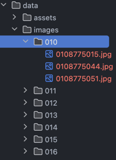

# Live coding @ Pycon Lithuania 2024
This repository contains the code used for the live coding workshop : ["Coding a vector database from scratch"](https://pycon.lt/2024/talks/VTKGSM)

## Required assets

### Product pictures

In order to have the fully functioning app, you'll need to download the H&M product pictures
from the kaggle H&M challenge and place it in the "data/images" directory a the root of the cloned 
repo.

Each picture, containing the product_id in its name must be store in a subdirectory containing the
three first digits of the product_id

It should look like this:

### Pickled products embeddings

You can find on this repo, the 105k images embeddeg using fashion clip. 
You'll need to install git-lfs to be able to pull them:

    data/dict_ids_embeddings_full.pickle

You can also use 

    python gc_db/embedding/embedder.py

It will embed all the images found in 

    IMAGES_PATH: str = str(ROOT_DIR / './data/images')

## How to make it work locally on your computer
Clone the repository

    pip install .
    make run 

Or if you want to use HNSW lib
    
    make run-hnsw

## Need Help ? 

You can reach us at aurelien.massiot@octo.com or philippe.stepniewski@octo.com

## Credits

- Kaggle H&M personalized recommendations https://www.kaggle.com/competitions/h-and-m-personalized-fashion-recommendations
- Fashion Clip model by Patrick John Chia https://github.com/patrickjohncyh/fashion-clip
- mattmdjaga's segformer model used for clothe segmentation https://github.com/mattmdjaga/segformer_b2_clothes